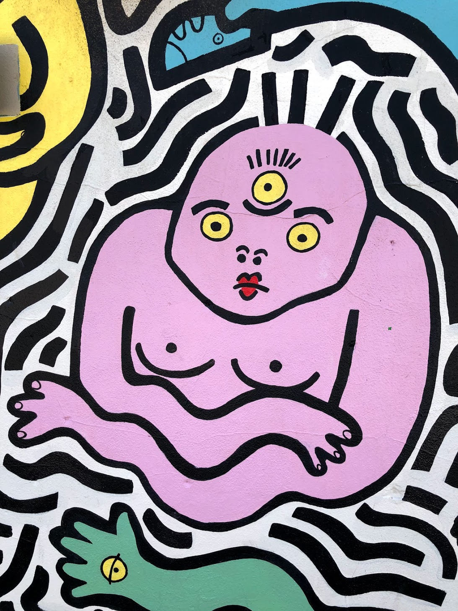

import Layout from "../../components/layout"

export default Layout

# Boise Freak Theme




```js
// example colors with freak mode
colors: {
  ...
  modes: {
    freak: {
      text: 'hsl(212, 24%, 8%))',
      background: 'hsl(0, 0%, 97%)',
      primary: 'hsl(306, 49%, 79%)',
      secondary: 'hsl(197, 52%, 59%)',
      highlight: 'hsl(353, 80%, 45%)',
      muted: 'hsl(155, 27%, 50%)',
      gray: 'hsl(227, 11%, 50%)',
      header: {
        text: 'inherit',
        background: 'inherit',
      },
    }
  }
}
```
